# Zeal Clinic Server

<p align="center">
  <strong>One Go program, built twice, behind a clinic-management system: the API, the staff dashboard, PDFs
  and an encrypted database, as a Windows tray app on the clinic's PC and as a Linux copy in the cloud that
  stays in sync with it both ways.</strong>
</p>

<p align="center">
  
</p>

Zeal Clinic is a clinic-management system built for an aesthetic clinic in Lebanon: appointments by room and
hour, patient records with allergies, medicines and prescriptions, invoices, payments and balances, gift cards
and offers, stock and suppliers, the price list, staff schedules and salaries, reports and an audit trail.
Staff use it from browsers; patients never sign in, and what each member of staff can do comes from their role.

This repository is the server. The same Go program is built twice. The clinic edition runs on a Windows PC at
the clinic as a tray app with an installer, serves the dashboard and the API to browsers on the clinic's
network, and keeps everything in one encrypted SQLite file. The cloud edition is a static Linux binary behind
an HTTPS proxy, so staff can also work from outside the clinic.

The engineering constraint is the interesting part: two copies of one SQLite database on two machines, both
taking writes, one of them a PC that can be switched off. Replication is built from database triggers, an
outbox and plain HTTP, with conflict rules set per table; money records are never deleted by sync, and the
cloud refuses money writes until the clinic is connected and caught up. No C compiler is needed: SQLite runs
as WebAssembly translated to Go, on an encrypting file system.

## Highlights

**The product**

- One program, two editions: the clinic edition (Windows tray app and installer, port 55555) and the cloud
  edition (`-tags cloud`, a static Linux binary, port 8080)
- Serves the staff dashboard and a REST API from the same origin: 214 API routes on the clinic, 222 on a
  cloud node with its sync and publish secrets set
- Two-way sync between the clinic and the cloud within seconds, over 38 replicated tables
- 28 money routes on the cloud wait until the clinic has connected and completed a full sync cycle
- Five PDF documents: the invoice, with the amount in words and an LBP equivalent, the day or week schedule,
  and the revenue, expenses and analytics reports
- 82 permission scopes of the form `resource:read|write|delete`, checked per route; a role change reaches
  signed-in browsers at once
- An audit log of every successful change, with the request body and secrets blanked
- Encrypted backups every 3 hours when something changed, keeping the last 24
- Self-update from the About screen: HTTPS only, SHA-256 verified, rolled back if the new build doesn't come up
  healthy; updating the clinic updates the cloud in the same step
- Live updates over server-sent events: notifications, permission changes, sync and force-sync progress

**The build**

- Go 1.26.8 with no C compiler needed: `ncruces/go-sqlite3` with the Adiantum encrypting file system and a
  256-bit key
- Hand-written SQL on one writer connection and four readers, WAL mode, foreign keys on
- 45 tables and 15 goose migrations, seeding the roles, 8 rooms, currencies, 243 countries, 2,712 Lebanese
  cities and the clinic's price list of 145 procedures in 43 categories
- Config compiled into each build from committed development defaults and git-ignored overrides; a release
  build refuses to start on a development value
- 694 Go test functions in 131 files, 245 of them HTTP integration tests, plus 51 API contract goldens
- An 18-step system test that runs a real clinic node against real cloud nodes
- Tests run offline: Go runs with a dead proxy and `GOPROXY=off`
- `govulncheck` with 0 reachable findings, `gitleaks` over the tree and `actionlint` over the workflows

## Visual showcase

<table>
  <tr>
    <td width="31%">
      <a href="docs/images/zeal-clinic-invoice-pdf.png">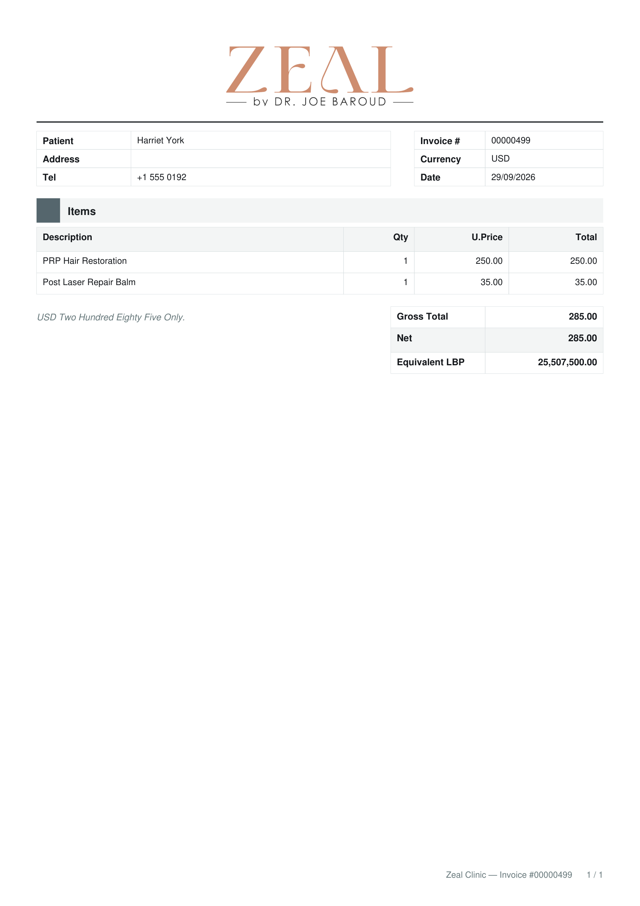</a>
    </td>
    <td width="69%">
      <a href="docs/images/zeal-clinic-invoice.png"></a>
    </td>
  </tr>
  <tr>
    <td align="center">The invoice PDF</td>
    <td align="center">The same invoice in the dashboard</td>
  </tr>
</table>

The PDF is drawn on the server with maroto: the clinic's logo, the lines, the total in words and its LBP
equivalent at the current rate. It is written under a name with a timestamp and a random suffix, served only to
signed-in users and deleted after 15 minutes.

<table>
  <tr>
    <td width="33%">
      <a href="docs/images/zeal-clinic-schedule-day.png">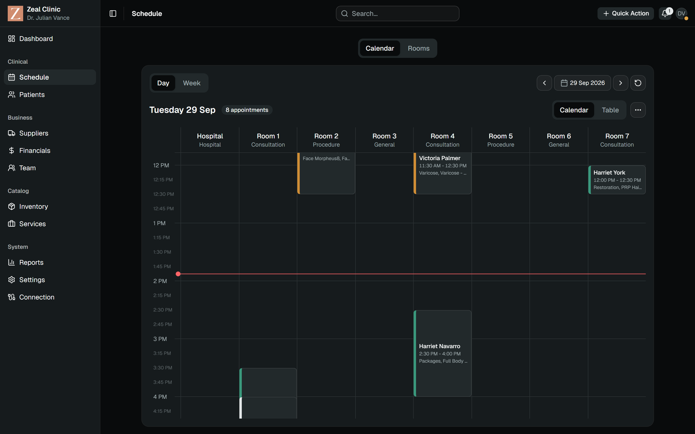</a>
    </td>
    <td width="33%">
      <a href="docs/images/zeal-clinic-reports.png">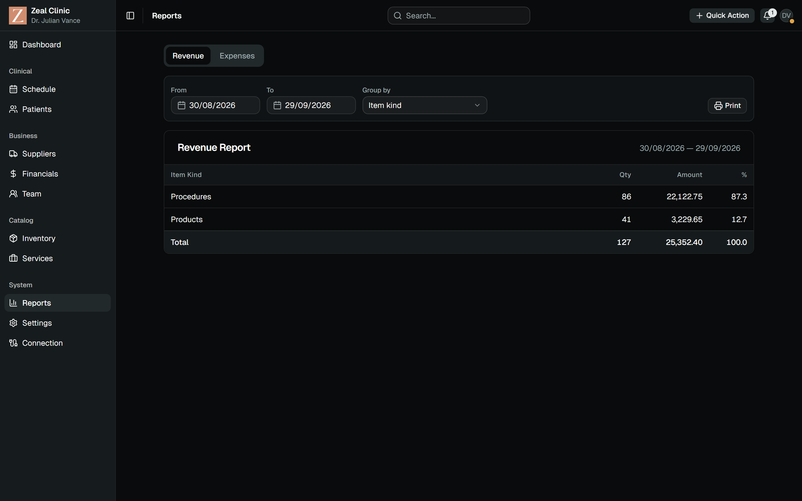</a>
    </td>
    <td width="33%">
      <a href="docs/images/zeal-clinic-price-list.png">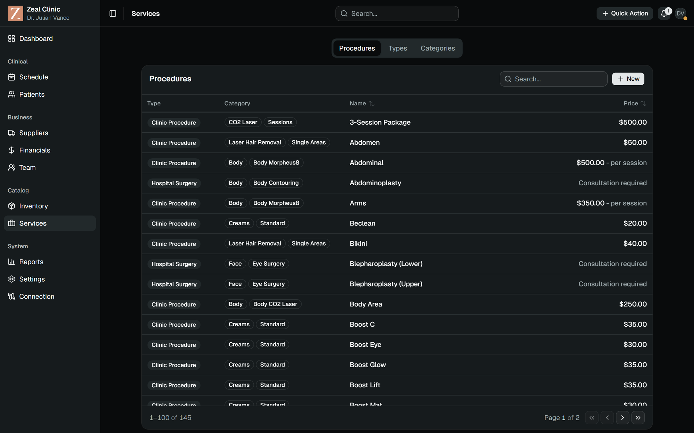</a>
    </td>
  </tr>
  <tr>
    <td align="center">Rooms by the hour</td>
    <td align="center">Revenue report</td>
    <td align="center">The price list</td>
  </tr>
</table>

The price list is data, not code: migrations seed the clinic's 145 procedures in 43 categories and 3 types,
staff maintain it from there, and each price change is kept as history. The revenue report groups by nine
dimensions and prints to PDF.

<table>
  <tr>
    <td width="33%">
      <a href="docs/images/zeal-clinic-permissions.png">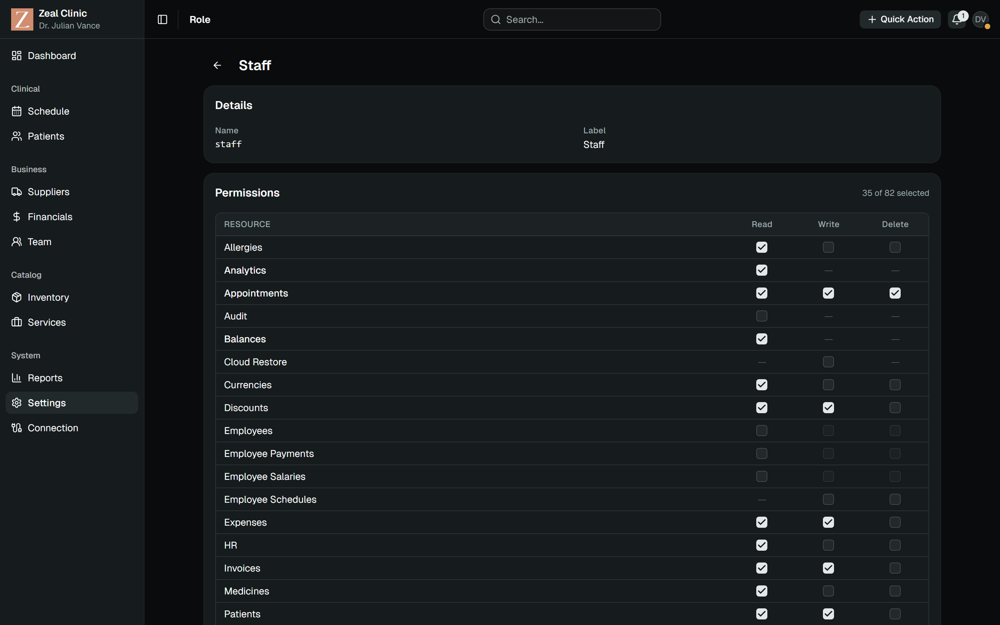</a>
    </td>
    <td width="33%">
      <a href="docs/images/zeal-clinic-audit-log.png">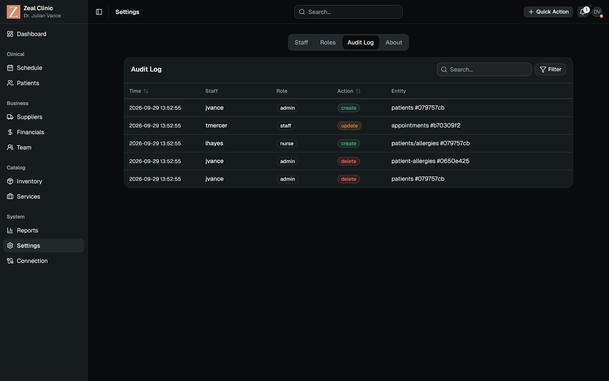</a>
    </td>
    <td width="33%">
      <a href="docs/images/zeal-clinic-about.png">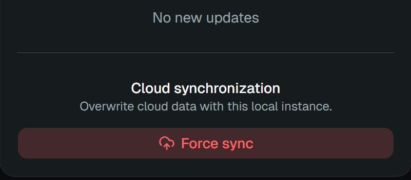</a>
    </td>
  </tr>
  <tr>
    <td align="center">35 of 82 scopes for staff</td>
    <td align="center">Audit log</td>
    <td align="center">Update check and force sync</td>
  </tr>
</table>

The matrix edits the same scopes the API checks per route; saving it tells every signed-in browser of that role
to reload its permissions. Force sync, on the clinic only, makes the cloud an exact copy of the clinic.

## Architecture

### System context

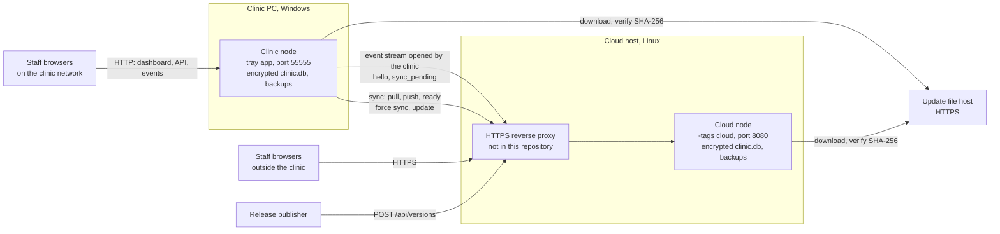

**The clinic is the active node.** It holds `PEER_URL`, runs pull-then-push cycles and keeps an event stream
open to the cloud; the cloud serves pulls, accepts pushes and wakes the clinic when it has something new. The
`/api/sync/*` routes exist only on a cloud build with `SYNC_SECRET` set.

**Releases are published to the cloud and flow down.** Posting `{version, platform, url, sha256}` to
`POST /api/versions` with the publish secret adds a row that syncs to the clinic. The update check is local:
About compares the newest row for the machine's operating system with the running version.

### The request path

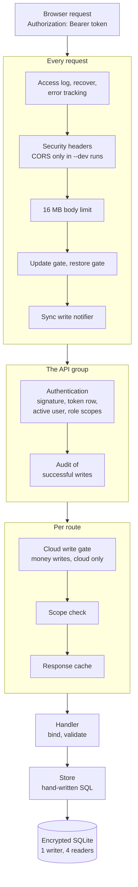

**Every answer is one envelope.** `{"Success": bool, "Data": ..., "Error": string}` with capitalised keys;
lists put `{"items": [...], "total": N}` in `Data`. Unknown routes, bodies over 16 MB and crashes under `/api`
answer in the same envelope. A store error maps to 404, 400, 409 or 500, so "still in use" and "duplicate"
come back as short messages instead of a generic server error.

**A valid signature is not enough.** Every issued token is stored: a request passes only if the token's row
exists and hasn't expired, the user is active and the role exists; then the role's current scopes load into the
request. Signing out deletes the row, and deactivating a user deletes all of theirs and signs their open tabs
out.

**Writes feed sync on their own.** Triggers queue every changed row in the outbox inside the write's own
transaction, and a successful write through the API schedules a sync cycle one second later, debounced.

### Build pipeline

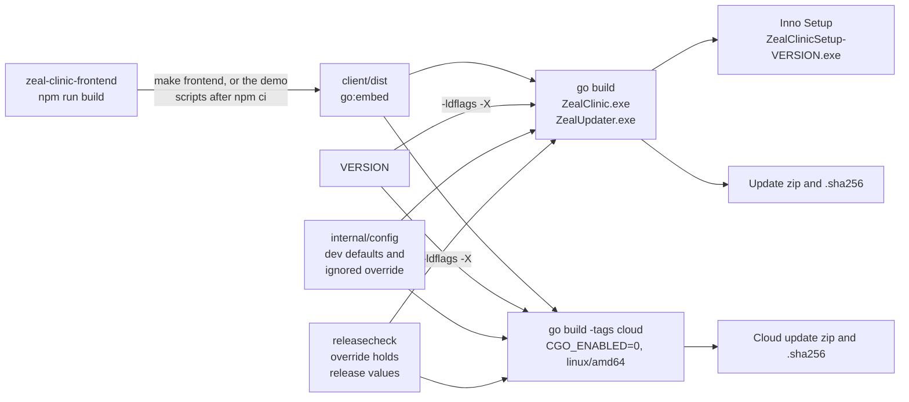

`make deploy` runs all of it: the dashboard build, the cloud release, the installer (which builds the Windows
release) and both update zips with their SHA-256 files. `make build` and `make dev` stamp the version with a
`-dev` suffix, which counts as a development build.

### Main entities

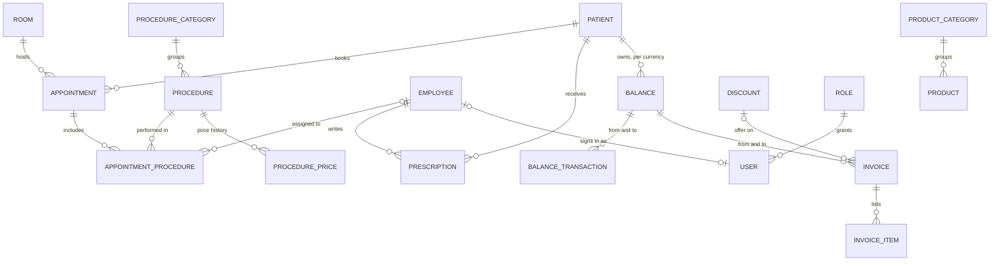

**Money is a ledger between balances.** A balance exists per owner and currency, the owner being a patient, a
supplier, an employee, an expense account or the clinic itself. An invoice and every balance transaction move
value from one balance to another; transactions are charges, payments, refunds, adjustments or write-offs, by
cash, card, transfer, discount or other. Balances are a projection of the active transactions, recomputed in
the same database transaction as each write, and money rows are voided, never deleted. An invoice line is a
product, a procedure, a gift card or something else; a gift card becomes a code redeemed later or a credit to a
patient. The full schema is in [`docs/erd-dbdiagram.dbml`](docs/erd-dbdiagram.dbml).

## Sync

The clinic and the cloud each hold a full copy of the data and send each other their changes within seconds.
The clinic does the work: it opens a stream to the cloud, pulls the cloud's changes, then pushes its own.

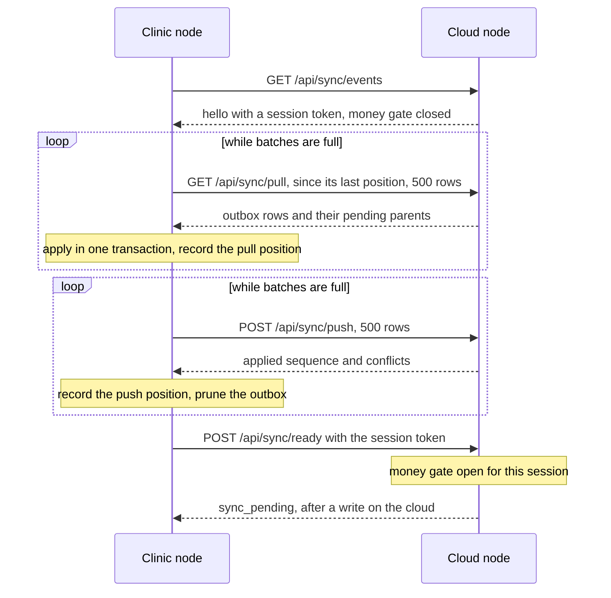

Every call carries `X-Sync-Secret`, compared in constant time and accepted only as a header, and
`X-Sync-Version`. The rules for what happens when the two copies disagree:

| Situation | What happens |
| --- | --- |
| The same row edited on both nodes | On the clinic, the local row stays when its `updated_at` is strictly newer; equal or missing timestamps let the incoming row win. The cloud always takes the clinic's row |
| A delete arrives | It removes the row even over a newer local edit, except on `invoices`, `invoice_items`, `balance_transactions` and `versions`, which never accept a remote delete, and except when rows this node keeps still reference it: the row then stays and goes back out with them |
| An edit arrives for a row deleted here but not yet sent | The row is re-created and the pending delete dropped. With both pending, the clinic pulls first, so the cloud's change arrives first |
| The parent of an incoming row is missing | The row is skipped until the parent arrives |
| Two rows claim one unique value | A delete of the other row in the same batch runs first. Otherwise, for allergy names, usernames and discount codes, the row with the greater id takes a short suffix from its own id and goes back out, so both nodes converge; any other clash parks the incoming row |
| The peer runs another build version | Refused with 409: data flows only between identical versions |
| A money write on the cloud | 28 routes answer 503 `sync_not_ready` until the clinic's current stream session has completed pull, push and ready |
| Node-local tables | `tokens`, `audit_log`, `notifications` and the sync bookkeeping never leave their node |

**The outbox holds one entry per row.** Three triggers on each of the 38 replicated tables, 114 in all, write
`(table, row_id, op)` to `sync_log`, replacing that row's older entry. The row itself is read when the batch is
built, so adding a column needs no trigger change, and a row gone by then is sent as a delete. While sync
applies incoming rows it raises a guard that silences the triggers, so nothing echoes back.

**Parents travel with their children.** Because only the latest write per row is kept, an edited parent can sit
later in the log than its child. Each batch therefore carries the still-pending parents of its rows, found
through the schema's foreign keys, and the apply writes parents before children and deletes children before
parents, in one transaction; foreign keys are checked once at the end, and a failure names the row.

**Money is append-only across the link.** Invoices, their lines and balance transactions are voided, never
deleted, and sync refuses remote deletes of them, so nothing done on one node can erase a money record on the
other. After each batch, the balances its transactions touched are recomputed.

**The cloud waits for the clinic before taking money.** Balances are projections of transactions, and a payment
taken on a copy that is behind would be recorded against a balance that doesn't yet include the clinic's latest
transactions. So the cloud's money routes stay closed until the clinic has connected and completed a full cycle
in its current session. A failed cycle closes them again and sends every active user one "Data sync failed"
notice per outage.

**Every conflict the apply resolves is recorded.** Kept local rows, refused and overtaken deletes, skipped
orphans and renamed or parked unique clashes are written to `sync_conflicts` with the rows involved; no screen
reads it yet. The version refusal and the money gate answer the request instead.

**Force sync replaces the cloud's data with the clinic's.** An admin at the clinic can make the cloud an exact
copy. Both nodes enter maintenance, the clinic uploads an encrypted snapshot with its SHA-256, and the cloud
checks the size (up to 2 GiB), the checksum, integrity, foreign keys, the schema version and columns, backs
itself up, replaces the 38 synced tables and rolls back on any failure. Progress shows in every open browser.

## Security

Only staff sign in. Every request is checked against the permissions of the person's role, every change is
recorded, and the data is encrypted on disk. In detail:

- **Sign-in.** `POST /api/auth/login` issues an HS256 JWT with a unique id, valid for `JWT_LIFETIME`; there
  are no refresh tokens. An unknown user, a wrong password and a disabled account get the same 401 after the
  same hashing work, and each client address gets 10 attempts a minute before a 429
- **Passwords.** argon2id with 32 MiB, 5 iterations, parallelism 2 and a 16-byte salt, compared in constant
  time; used exactly as typed, and a password of spaces only is refused
- **Tokens on an allow-list.** Every request checks the signature, the issuer and the expiry, then the token's
  row, the user and the role, and loads the role's current scopes
- **Scopes.** 82, each gating at least one route, checked per route as one scope, all of several, or "the
  scope or it's your own record". The admin role always keeps the role and user management scopes, so it
  can't lock itself out, and the last active admin can't be demoted or deactivated. Search results are
  filtered per scope on the server
- **Headers.** Every answer carries `nosniff`, `X-Frame-Options: DENY`, a same-origin referrer policy and
  `noindex`; the app shell's content security policy allows only its own origin; `robots.txt` disallows
  everything
- **Limits.** 16 MB request bodies (the cloud's sync and restore uploads excepted), 10 seconds to send headers,
  120 seconds of idle keep-alive. CORS exists only in `--dev` runs and only for the dashboard's Vite dev server
- **Client address.** The clinic uses the connection's own address; the cloud reads `X-Forwarded-For`, trusted
  only from loopback and private-network proxies
- **Machine routes.** `X-Sync-Secret` and `X-Publish-Secret` are compared in constant time and read from headers
  only, and sync also requires the exact build version; the access log never records query strings under
  `/api/sync/`
- **Audit.** Every successful create, update and delete through the signed-in API is recorded with the user,
  role, action, entity, client address and request body, with password, pin, secret and token values blanked
- **At rest.** The database, its write-ahead log and every snapshot are encrypted. Update downloads must be
  HTTPS and match their SHA-256
- **Development runs stay local.** A development or demo run listens on `127.0.0.1` only, because its secrets
  and demo passwords are public; `--lan` opens it to the network
- **Transport.** Plain HTTP on the clinic's network; HTTPS to the cloud through the proxy, which is not part of
  this repository

## Configuration

Settings such as the port, the secrets and the clinic's time zone are compiled into each build rather than read
from a file when the program starts, and the repository holds development values only. There is no runtime
`.env`. Each build takes its configuration from two layers, key by key:

- `internal/config/local.env.defaults` (clinic) and `cloud.env.defaults` (cloud): committed development values,
  so a fresh clone builds and runs as it is
- `internal/config/local.env` and `cloud.env`: optional, git-ignored overrides that hold the real values for a
  release build, started from `local.env.example` and `cloud.env.example`

| Key | Purpose |
| --- | --- |
| `PORT` | The port the node listens on |
| `JWT_SECRET` | The key that signs session tokens; 32 characters or more in a release |
| `JWT_LIFETIME` | How long a sign-in lasts |
| `PEER_URL` | The clinic's cloud peer; empty means no sync |
| `SYNC_SECRET` | The shared secret of the sync and force-sync routes; the same on both nodes |
| `PUBLIC_URL` | The cloud's public address, shown on its Connection page |
| `PUBLISH_SECRET` | Enables `POST /api/versions` on the cloud for publishing releases |
| `DB_ENCRYPTION_KEY` | The database key, 64 hex characters; the same on both nodes, because force sync copies one database into the other |
| `CLINIC_TIMEZONE` | The clinic's time zone for today, weeks and reports; the same on both nodes |

A build stamped as a release refuses to start on a development value, a `JWT_SECRET` under 32 characters or a
malformed key, and its messages name keys, never values. `go run ./cmd/releasecheck clinic cloud` checks the
override files before a release build and requires the two nodes to share the sync secret, the database key
and the time zone; `make release` and `make release-cloud` run it for their node first.

## Technology

- Go 1.26.8
- Echo 4.15.3 for HTTP routing and middleware
- `ncruces/go-sqlite3` 0.34.0 with its Adiantum encrypting file system: SQLite compiled to WebAssembly and
  translated to Go
- goose 3.27.1 for migrations
- maroto 2.4.0 for the PDFs
- golang-jwt 5.3.1 for tokens, `golang.org/x/crypto` 0.56.0 for argon2id, `golang.org/x/time` 0.15.0 for the
  sign-in rate limit
- google/uuid 1.6.0 for time-ordered ids, godotenv 1.5.1 to read the embedded configuration
- getlantern/systray 1.2.2 for the clinic's tray icon (Windows)
- Inno Setup for the Windows installer; PowerShell 7 for the demo, CI and packaging scripts; POSIX `sh` for the
  Linux demo
- govulncheck 1.8.0, gitleaks 8.30.1 and actionlint 1.7.12 in CI

## Repository map

| Path | Responsibility |
| --- | --- |
| `cmd/server/` | The entry point: flags, startup order, shutdown, the single-instance lock on Windows |
| `cmd/updater/` | The Windows update swapper |
| `cmd/releasecheck/` | The pre-release configuration check |
| `cmd/legacyimport/` | A one-off importer for the previous system's CSV exports |
| `internal/api/server/` | Echo setup, global middleware and hardening, the app shell and `/files`, the error envelope, the HTTP integration and contract tests |
| `internal/api/routes/` | One file per resource: path, scope, cache keys and the cloud write gate |
| `internal/api/handlers/` | Bind, validate, call the store, answer in the envelope |
| `internal/api/middleware/` | Authentication, scopes, the response cache, the audit log, the update gate |
| `internal/database/` | Opening the encrypted database, migrations, backups, the demo seed |
| `internal/database/store/` | Models, every SQL statement and the business rules |
| `internal/database/migrations/` | The goose schema and seeds, with the country and city reference data |
| `internal/sync/` | Outbox replication, pull and push, the event stream client, the cloud write gate |
| `internal/cloudrestore/` | Force sync: snapshot, upload, verify, replace, roll back |
| `internal/updater/` | The update check, download, verification, apply and rollback |
| `internal/monitor/` | Scheduled work: reminders, backups, offer expiry, low stock, token and PDF clean-up |
| `internal/pdf/` | The five PDF documents |
| `internal/realtime/` | The server-sent events hub |
| `internal/auth/`, `internal/scopes/` | Tokens, argon2id passwords and the list of 82 scopes |
| `internal/config/` | The embedded configuration per build and the release rules |
| `internal/systray/`, `internal/browser/`, `internal/assets/` | The desktop pieces: tray, browser launch, icons and logos |
| `client/` | `embed.go`; the dashboard build is copied into `client/dist` |
| `build/local/` | The Inno Setup script and the icon |
| `systest/` | The two-node system test |
| `scripts/` | The demo scripts, the CI stages, packaging and the test stack |
| `.github/workflows/` | `ci.yml` and `nightly.yml` |
| `docs/` | The ERD, the user guide PDF and the images in this README |

## Getting started

**Prerequisites.**

- Go 1.26.8 (`go.mod`); an older Go 1.21 or newer downloads 1.26.8 once while `GOTOOLCHAIN` is `auto`, the
  default
- Node `^20.19.0 || ^22.13.0 || >=24.0.0` and npm, to build the dashboard; the first build downloads its
  packages
- Windows: PowerShell 7 (`pwsh`). Linux: `sh`, `curl` and the usual tools
- git to clone; GNU make is optional, every target has a direct command
- The dashboard cloned next to this repository as `zeal-clinic-frontend`, the default of `make`, `-Frontend`
  and `--frontend`

**Windows, one node.**

```powershell
git clone https://github.com/Elia-Youssef/zeal-clinic-backend
git clone https://github.com/Elia-Youssef/zeal-clinic-frontend
cd zeal-clinic-backend
pwsh scripts/demo.ps1          # or: make demo
```

The script checks the tools and the port, builds the dashboard (`npm ci`, `npm run build`) into `client/dist`,
builds a development server stamped `1.1.0-dev`, seeds demo data into `tmp/demo/clinic/`, starts it, waits for
its health check, prints `Demo ready: http://127.0.0.1:55555` with the sign-ins and opens the browser. The data
is kept between runs; `-Reset` starts over. Other options: `-Frontend <path>`, `-Port <n>`, `-Lan`,
`-NoBrowser`, `-BinDir <dir>`. Ctrl+C stops it cleanly.

**Windows, the clinic and the cloud side by side.**

```powershell
pwsh scripts/demo-two-node.ps1   # or: make demo-two-node
```

A clinic node on 55555 and a cloud node on 8080 on the same machine. The clinic's `PEER_URL` reaches its build
through a `go build -overlay` file outside the checkout, so nothing is written into the configuration folder, and
both use the committed development sync secret. Once both are up, the script signs in as `jvance` and runs a
force sync so both nodes start from the clinic's data, then waits until the cloud accepts money writes. A
payment taken on one node shows on the other.

**Linux, the cloud node.**

```bash
sh scripts/demo-cloud.sh         # or: make demo
```

Builds and seeds the cloud edition on port 8080 in `tmp/demo/cloud/`, with the options `--frontend`, `--port`,
`--lan`, `--reset` and `--no-browser`. Without its clinic the cloud keeps invoices and payments closed, so money
is read-only there. The two-node demo is Windows-only, because the clinic node is. In WSL with its default NAT
networking, `--lan` prints an address other devices can't reach.

**Downloaded as a ZIP?** Windows marks files extracted from a downloaded ZIP, and PowerShell's RemoteSigned
policy then refuses `pwsh -File scripts/demo.ps1`. `make demo` and `make demo-two-node` already pass
`-ExecutionPolicy Bypass`; otherwise unblock the folder with
`Get-ChildItem -Recurse | Unblock-File` or run `pwsh -ExecutionPolicy Bypass -File scripts/demo.ps1`. On
Linux a ZIP drops the executable bit, so start the demo with `sh scripts/demo-cloud.sh`. GitHub's ZIPs also
extract as `zeal-clinic-backend-main` and `zeal-clinic-frontend-main`, while the demo looks for the dashboard in
`../zeal-clinic-frontend`: rename that folder, or pass its path with `-Frontend <path>` (`--frontend <path>` on
Linux, `FRONTEND=<path>` with make). A git clone has none of these problems.

**Sign in** with the password `demo123` as `jvance` (admin), `tmercer` (staff), `lhayes` or `mowens` (nurses).
The demo holds 152 invented patients with appointments around today, invoices, payments, expenses and gift
cards; its dates are anchored to the day it was seeded. Without demo data the only account is `super-admin`,
and the first password typed becomes its password.

**Developing.** On Windows, `make dev-demo` then `make dev` run a development clinic server on demo data in
`./tmp` (`go run ./cmd/server --dev --seed-only --demo`, then `go run ./cmd/server --dev`). They build the
clinic edition, which is Windows-only; on Linux or macOS use the cloud edition, seeded with
`go run -tags cloud ./cmd/server --dev --seed-only --demo` and run with `make dev-cloud`
(`go run -tags cloud ./cmd/server --dev`), with its data in `./data`. `make frontend` rebuilds the dashboard into
`client/dist`; a backend-only clone builds too and serves a one-line "Frontend not built." page. For work on the
dashboard itself, its Vite dev server on port 5173 calls this server directly, which accepts it only in `--dev`
runs.

Tests for the clinic edition, on Windows:

```powershell
go vet ./...
go test ./...
```

Tests for the cloud edition, on any system:

```bash
go vet -tags cloud ./...
go test -tags cloud ./...
```

### Operating a node

- **Installing.** The installer needs administrator rights, puts the app under
  `%LOCALAPPDATA%\Zeal Clinic\App` with data in `Data` and backups in `backup`, adds a firewall rule for TCP
  55555 scoped to the program, creates the database and offers to start with Windows. Uninstalling asks before
  deleting the data and keeps it by default
- **Running.** A tray icon offers Open Browser and Quit. One copy runs per machine; a second launch just opens
  the browser
- **Other devices** on the clinic's network open `http://<LAN address>:55555`; the Connection page shows the
  address with a QR code
- **First sign-in.** On a fresh installation the first password typed for `super-admin` becomes its password
- **Backups** run every 3 hours when something changed, and before every self-update and every force sync on
  the cloud
- **Updating.** About offers a newer published build; Update runs a sync cycle first, asks the cloud to update
  too, then swaps the program and restarts. On Windows, if the new build doesn't report healthy within 30
  seconds, the old program and database come back; on Linux the new build runs on trial and the next start
  rolls it back unless its health check passed

<p align="center">
  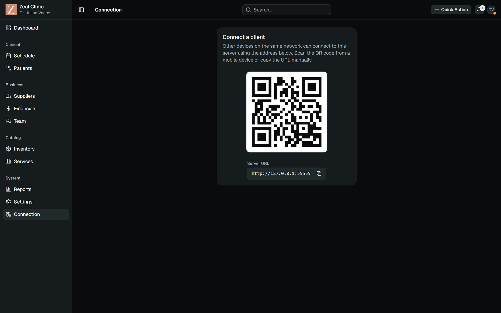
</p>

## Verification

Every stage runs through `scripts/ci.ps1`, the same way locally and on GitHub Actions. The stages write
throwaway test secrets into the checkout, so the script refuses to run anywhere but a GitHub runner or a
throwaway clone marked with an empty `.ci-scratch` file at its root; in a normal clone, run `go vet` and
`go test` as above.

| Gate | What it proves | Current |
| --- | --- | --- |
| `env-check` | The committed configuration holds development values only and the overrides are ignored | Clean |
| `fmt` | gofmt over the tracked Go files, as a ratchet: no new unformatted file | Pass, 2 known files |
| `mod` | `go mod verify` and `go mod tidy -diff` | Clean |
| `platform` | The cloud build has no tray dependency | Pass |
| `vet` | `go vet` for both editions, cross-compiled | Clean |
| `go-test` | Unit, store and HTTP integration tests for both editions, offline | Clinic 668 passed and 3 skipped; cloud 682 passed and 4 skipped |
| `contract` | API contract goldens, and parity with the dashboard's scopes, endpoints and envelope | 51 golden files |
| `vuln` | govulncheck for both editions; a new reachable finding fails | 0 reachable |
| `secrets` | gitleaks over the tree, with the history as a report | 0 in the tree |
| `system` | A clinic node and two cloud nodes built and run against each other: the money gate, the first sync, conflicts, newer wins, the ledger, deletes, version mismatch, update, resilience, a backup drill, force sync and its failures, long streams, large uploads, shutdown | 18 of 18 steps |
| `package` | Release builds and smoke checks: the installed layout seeds a database, the Linux binary is static, the zips match their SHA-256 | Windows exe 31.3 MB, Linux binary 30.7 MB |
| `workflows` | actionlint over the workflow files | Clean |

On GitHub, `ci.yml` runs on pushes to `main` and on pull requests: static checks, the clinic tests on Windows,
the cloud tests on Ubuntu, the package build, the dashboard's smoke walk against this server, the system test
and the security scans. A daily run at 22:30 UTC, while the UTC date and the clinic's differ, repeats the clinic
and cloud tests and the smoke walk. `nightly.yml` runs the cloud tests in four time zones, the full browser
suite, the long system checks and the vulnerability scan.

## Design decisions worth knowing

**Sessions live per browser tab.** The dashboard keeps its token in `sessionStorage`, so each tab signs in on
its own and closing the tab ends the session. The cost is a sign-in for every new tab; the gain is that no
token outlives its tab in the browser's storage, and the other tabs stay signed in when one signs out.

**The clinic edition is Windows-only.** The tray icon, the single-instance lock, the installer and the update
swapper are Windows pieces, and the tray library needs cgo elsewhere. Every other system builds the cloud
edition, which is also what CI tests on Linux.

**The first sign-in sets the password.** An account created without a password, including the seeded
`super-admin`, takes the first password typed. An installation therefore ships with no default password and is
set up at the clinic.

**A hidden super-admin.** One account exists for setup and recovery. It is left out of the staff list, the roles
list and the audit log viewer.

**Cloud money writes wait for the clinic.** The 28 money routes on the cloud answer 503 until the clinic has
completed a full sync cycle in its current session, as described under [Sync](#sync). Reading, scheduling and
patient work go on regardless.

**Some data never syncs.** Tokens stay on their node, so a sign-in on the clinic is not a sign-in on the cloud;
each node keeps its own audit log and notifications; the sync bookkeeping is node-local by nature. Rows written
by the legacy importer never enter the outbox: the imported database is copied to the cloud instead.

**Generated PDFs are short-lived links.** Any signed-in user with the link can open a generated PDF; its name
carries a timestamp and a random suffix, and the file is deleted after 15 minutes.

## Repository scope

This repository is the complete server: source, migrations and reference data, the tests and the system test,
the CI script, its baselines and the workflows, and the installer script. The dashboard lives in its own
repository and is copied in at build time; only `client/dist/.gitkeep` is tracked. Real configuration values
are not in the repository, as every committed value is for development; the HTTPS proxy in front of the cloud
and the host that serves update files are not part of it either. Generated output (`tmp/`,
`build/*/output/`, PDFs) is not committed.

This README describes version 1.1.0. The tags `v0.1.0-beta`, `v0.2.10-beta`, `v0.4.0-beta`, `v1.0.0` and
`v1.0.3` are snapshots of the releases as they shipped. They are history rather than build targets: the v1.0.x
backends need a file in `client/dist` before `go build` succeeds (the one-line placeholder `scripts/ci.ps1`
writes), and the dashboard's snapshots carry no `package-lock.json`.

## Connected repositories

- [zeal-clinic-frontend](https://github.com/Elia-Youssef/zeal-clinic-frontend): the staff dashboard, React 19
  and TypeScript, with its design system, unit tests and the browser tests that run against this server.

## User guide

[`docs/Zeal-Clinic-User-Guide.pdf`](docs/Zeal-Clinic-User-Guide.pdf) is the staff guide for version 1.1.0,
written for the people at the clinic rather than for developers: signing in, patients, appointments, billing,
inventory and suppliers, team and HR, the dashboard and reports, administration and help, illustrated with
the demo data. The same guide is in both repositories.

## Ownership and licensing

Copyright (c) 2026 Elia Youssef and Rebel Art Studios. All rights reserved.

No open-source license is granted. Unless a separate written agreement with the copyright holders grants
permission, the source is provided for viewing and portfolio reference only; see [LICENSE](LICENSE).

The "Zeal Clinic" name and logo and the clinic's price list belong to the clinic and are used with its
permission. They are not covered by this notice and may not be reused. Every person in the demo data and the
screenshots is invented.

Third-party components keep their own licenses; see [THIRD_PARTY_NOTICES.md](THIRD_PARTY_NOTICES.md).

Designed and built by Rebel Art Studios ([LinkedIn](https://www.linkedin.com/in/elia-youssef)).
